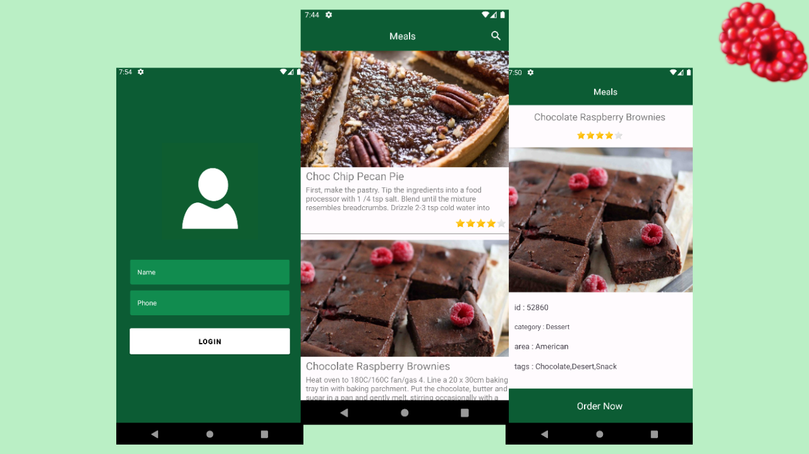

<h1 align="center">Menu</h1>

  
  
   
  
  
  

  

⭐ This project aims to demonstrate my technical knowledge in native development for android with kotlin. More information below.

Mobile application that presents a list of meals based on traditional American dishes with a search system and a whatsapp ordering service. 

 

## Download
Download <a href="Menu/apk/app-debug.apk?raw=true">APK</a> directly. You can see <a href="https://www.google.com/search?q=como+instalar+um+apk+no+android">here</a> how to install an APK in your android device.

## Technologies used and open source libraries

- Minimum SDK level: 24
- [Kotlin Language](https://kotlinlang.org/) 

- Jetpack 
  - Lifecycle: Observe the android lifecycle and manipulate UI states after lifecycle changes.
  - ViewModel: Manages user interface-related data retention and lifecycle. Allows data to survive configuration changes, such as screen rotations.
  - ViewBinding: It links the XML components in Kotlin through a class that guarantees type safety and other advantages.
  - Material Design Components: Modular and customizable components of the Material Design UI for Android.
  

- Architecture
  - MVVM (View - ViewModel - Model)
  - Communication between ViewModel and View via LiveData.
  - Repositories for abstracting communication with the data layer.
  
- Bibliotecas 
  - [Retrofit2 & OkHttp3](https://github.com/square/retrofit): To make HTTP standard requests.
  - [Picasso](https://github.com/square/picasso): For image loading and caching.

## Architecture

**Menu** uses the MVVM architecture and the Repositories standard, which follows the [official Google recommendations](https://developer.android.com/topic/architecture).
  

## Third's API

Menu uses [TheMealDB](https://www.themealdb.com/api.php) to make its REST calls. 
TheMealDB provides for free a complete REST API with a list of meals.

## Features

Listing of meals. Search system by title and display of descriptions. Dynamic uploading of images via the web and integration with whatsapp via external links. 

# License

Copyright [2023] [Aladin Bento Ferreira Júnior]

   Licensed under the Apache License, Version 2.0 (the "License");
   you may not use this file except in compliance with the License.
   You may obtain a copy of the License at

     http://www.apache.org/licenses/LICENSE-2.0

   Unless required by applicable law or agreed to in writing, software
   distributed under the License is distributed on an "AS IS" BASIS,
   WITHOUT WARRANTIES OR CONDITIONS OF ANY KIND, either express or implied.
   See the License for the specific language governing permissions and
   limitations under the License.
